# IAM-006 - Enterprise Identity Operations and Risk Analytics


[Back to Portfolio](https://github.com/KSWISHA9)


Enterprise identity risk analytics, Microsoft Entra ID posture assessment, executive reporting, and remediation planning using Microsoft Graph PowerShell.

---

## Business Request

OmniVerse leadership requested an internal identity operations toolkit to assess Microsoft Entra ID risk across users, privileged roles, enterprise applications, workload identities, and identity hygiene - and to deliver executive-level reporting that shows measurable security improvement.

---

## Architecture

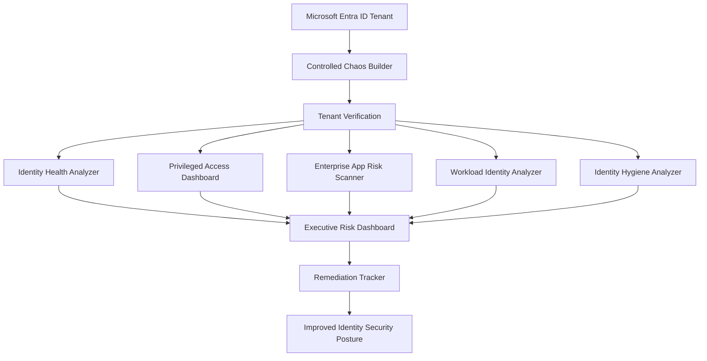

---

## Walkthrough

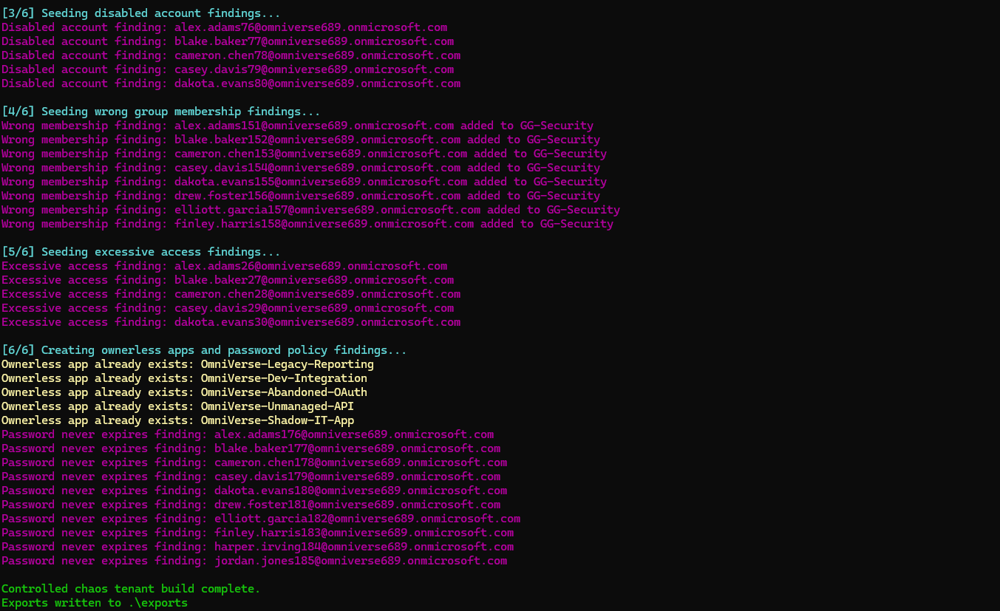

The controlled chaos builder created 200 lab users across 8 departments with intentional identity findings - disabled accounts left in active groups, excessive access, password policy exceptions, and ownerless applications.

---

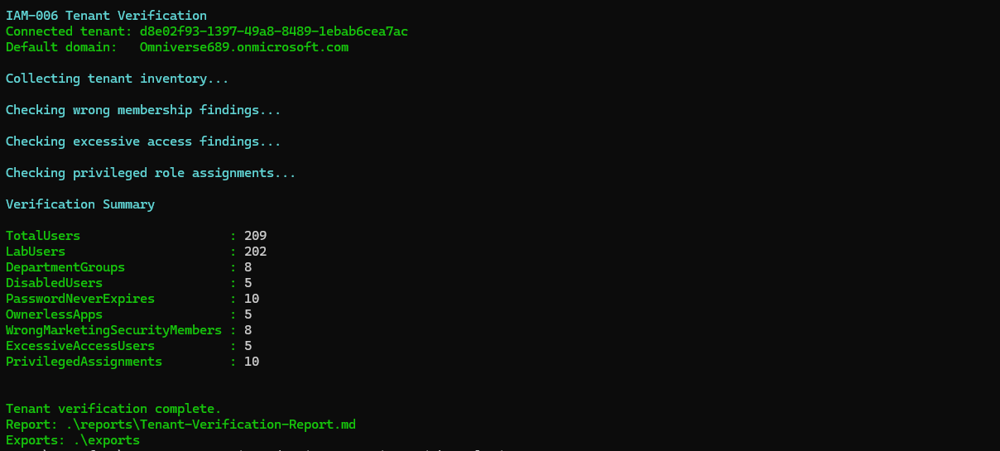

The verification script confirmed all expected IAM-006 findings were present in the tenant before analytics were generated.

---

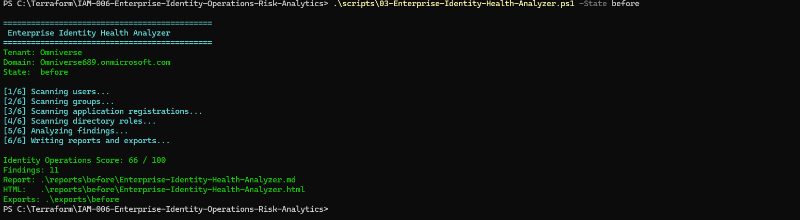

The Identity Health Analyzer performed a live Microsoft Graph assessment and produced an initial identity operations score across all finding categories.

---

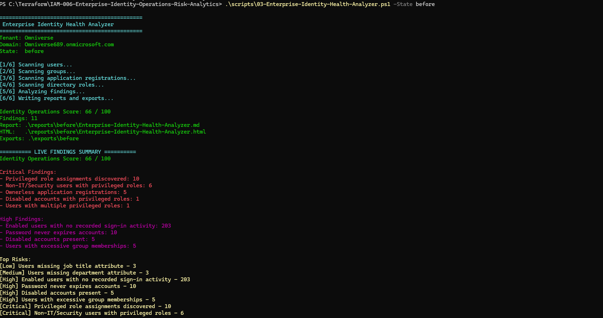

Critical and high-risk findings surfaced - privileged assignments, ownerless applications, disabled accounts, and users with excessive access across multiple department groups.

---

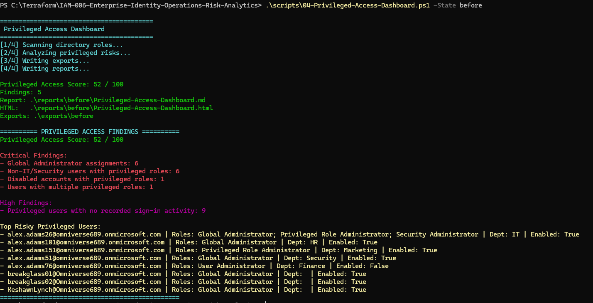

The Privileged Access Dashboard reviewed permanent role assignments, non-IT administrative access, disabled privileged accounts, and users holding multiple privileged roles simultaneously.

---

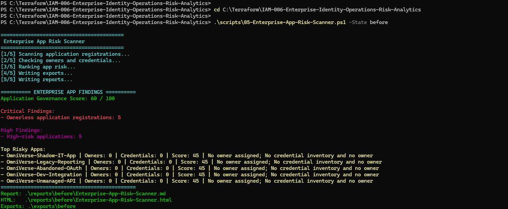

The App Risk Scanner identified ownerless application registrations, expiring credentials, and abandoned applications requiring governance review or decommission.

---

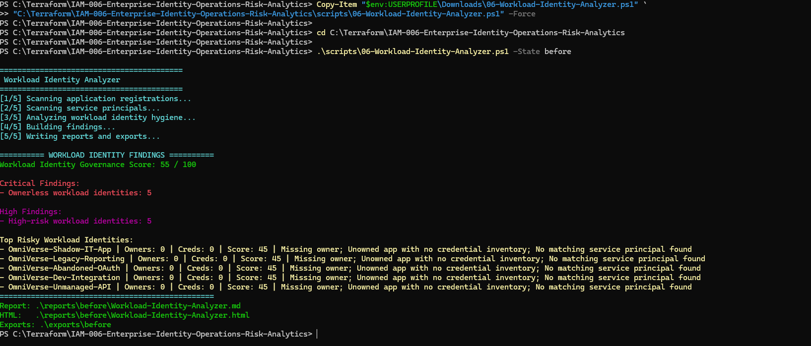

The Workload Identity Analyzer reviewed service principal hygiene and application ownership - identifying workload identities with no owner and no credential rotation policy.

---

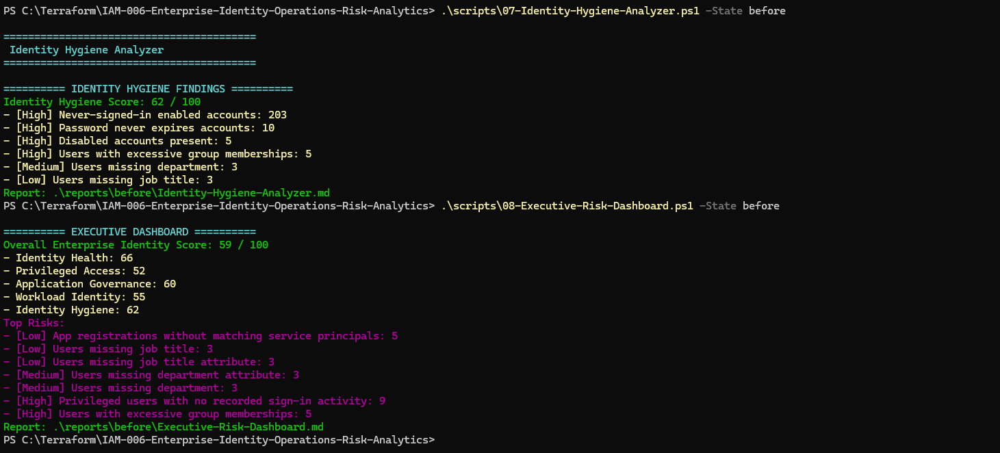

The Identity Hygiene Analyzer reviewed disabled accounts, missing directory attributes, excessive group memberships, and other lifecycle issues across the full user population.

---

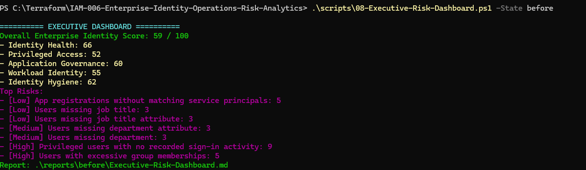

Before remediation, the tenant scored **59 / 100** - high identity operations risk across privileged access, application governance, and identity hygiene.

---

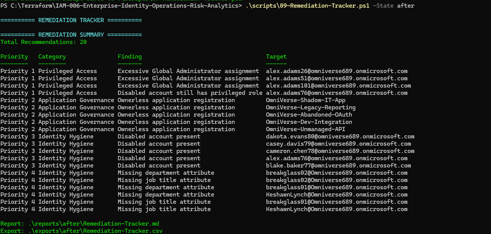

After remediation, the tenant improved to **88 / 100** - demonstrating measurable security posture improvement across every category.

---

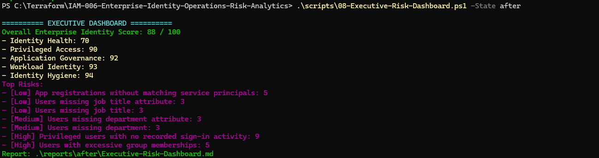

The Remediation Tracker generated prioritized recommendations across all finding categories and tracked the actions taken to reach the improved security posture.

---

## Table of Contents

- [Business Request](#business-request)
- [Architecture](#architecture)
- [Walkthrough](#walkthrough)
- [Before vs After](#before-vs-after)
- [Project Objectives](#project-objectives)
- [Toolkit Modules](#toolkit-modules)
- [Reports Generated](#reports-generated)
- [Skills Demonstrated](#skills-demonstrated)
- [Lessons Learned](#lessons-learned)
- [Future Enhancements](#future-enhancements)
- [Repository Structure](#repository-structure)
- [How to Run](#how-to-run)
- [Related Projects](#related-projects)

---

## Before vs After

| Metric | Before | After |
|---|---|---|
| Identity Health | 66 | 70 |
| Privileged Access | 52 | 90 |
| Enterprise Apps | 60 | 92 |
| Workload Identity | 55 | 93 |
| Identity Hygiene | 62 | 94 |
| **Overall Enterprise Identity Score** | **59** | **88** |

---

## Project Objectives

- Build a realistic Microsoft Entra ID environment with enterprise users, groups, and applications
- Simulate enterprise IAM security findings across multiple risk categories
- Analyze identity posture using Microsoft Graph PowerShell at scale
- Generate executive dashboards showing risk scores and findings
- Produce remediation recommendations for each finding category
- Demonstrate measurable security improvement through before-and-after reporting

---

## Toolkit Modules

| Script | Purpose |
|---|---|
| 01-Build-Controlled-Chaos-Tenant.ps1 | Builds users, groups, risky identities, and ownerless applications |
| 01.5-Seed-Privileged-Identity-Risks.ps1 | Seeds privileged identity findings |
| 02-Verify-Tenant.ps1 | Validates tenant inventory and expected lab findings |
| 03-Enterprise-Identity-Health-Analyzer.ps1 | Performs overall identity posture analysis |
| 04-Privileged-Access-Dashboard.ps1 | Reviews privileged role assignments and admin risk |
| 05-Enterprise-App-Risk-Scanner.ps1 | Reviews application registration governance |
| 06-Workload-Identity-Analyzer.ps1 | Reviews workload identity ownership and credential risk |
| 07-Identity-Hygiene-Analyzer.ps1 | Reviews user hygiene issues |
| 08-Executive-Risk-Dashboard.ps1 | Combines scores into an executive dashboard |
| 09-Remediation-Tracker.ps1 | Generates remediation recommendations |
| Start-IAM006.ps1 | Unified operations console |

---

## Reports Generated

| Report | Format |
|---|---|
| Enterprise Identity Health | Markdown, CSV |
| Privileged Access Dashboard | Markdown, CSV |
| Enterprise App Risk Scanner | Markdown, CSV |
| Workload Identity Analyzer | Markdown, CSV |
| Identity Hygiene Analyzer | Markdown, CSV |
| Executive Risk Dashboard | Markdown, HTML |
| Remediation Tracker | Markdown |

---

## Skills Demonstrated

- Microsoft Entra ID Administration
- Microsoft Graph PowerShell
- Identity Governance
- Privileged Access Analysis
- Workload Identity Security
- Enterprise Application Governance
- Identity Hygiene Assessment
- PowerShell Automation
- Risk Scoring and Security Metrics
- Executive Security Reporting
- IAM Remediation Planning
- Technical Documentation

---

## Lessons Learned

- Identity risk is easier to communicate when technical findings are converted into business-level scores.
- Privileged access should be reviewed separately from general identity hygiene because the impact is significantly higher.
- Ownerless applications and workload identities create long-term governance risk that accumulates silently.
- Dashboards are more valuable when they include both findings and remediation recommendations.
- Before-and-after reporting gives leadership a clear way to measure security improvement over time.

---

## Future Enhancements

- Microsoft Entra Identity Protection integration
- Conditional Access policy analysis
- Authentication methods audit
- PIM activation history analysis
- Access Reviews integration
- Entitlement Management reporting
- HTML dashboards with charts and trend history
- Microsoft Sentinel workbook integration

---

## Repository Structure

```text
IAM-006-Enterprise-Identity-Operations-Risk-Analytics/
|-- scripts/
|   |-- 01-Build-Controlled-Chaos-Tenant.ps1
|   |-- 01.5-Seed-Privileged-Identity-Risks.ps1
|   |-- 02-Verify-Tenant.ps1
|   |-- 03-Enterprise-Identity-Health-Analyzer.ps1
|   |-- 04-Privileged-Access-Dashboard.ps1
|   |-- 05-Enterprise-App-Risk-Scanner.ps1
|   |-- 06-Workload-Identity-Analyzer.ps1
|   |-- 07-Identity-Hygiene-Analyzer.ps1
|   |-- 08-Executive-Risk-Dashboard.ps1
|   |-- 09-Remediation-Tracker.ps1
|   `-- Start-IAM006.ps1
|-- images/
|-- reports/
|-- exports/
|-- dashboards/
|-- docs/
`-- README.md
```

---

## How to Run

Connect to Microsoft Graph:

```powershell
Connect-MgGraph -Scopes "User.ReadWrite.All","Group.ReadWrite.All","Application.ReadWrite.All","Directory.ReadWrite.All","RoleManagement.ReadWrite.Directory"
```

Run the full operations console:

```powershell
.\scripts\Start-IAM006.ps1 -State after
```

Run individual modules:

```powershell
.\scripts\03-Enterprise-Identity-Health-Analyzer.ps1 -State before
.\scripts\04-Privileged-Access-Dashboard.ps1 -State before
.\scripts\05-Enterprise-App-Risk-Scanner.ps1 -State before
.\scripts\06-Workload-Identity-Analyzer.ps1 -State before
.\scripts\07-Identity-Hygiene-Analyzer.ps1 -State before
.\scripts\08-Executive-Risk-Dashboard.ps1 -State before
.\scripts\09-Remediation-Tracker.ps1 -State after
```

---

## Related Projects

| Project | Description |
|---|---|
| [IAM-001 Hybrid Identity](https://github.com/KSWISHA9/IAM-001-Hybrid-Identity-Engineering) | Active Directory and Microsoft Entra Connect |
| [IAM-003 Identity Lifecycle](https://github.com/KSWISHA9/IAM-003-Identity-Lifecycle-Automation) | Joiner-Mover-Leaver automation |
| [IAM-004 Zero Trust](https://github.com/KSWISHA9/IAM-004-Conditional-Access-Zero-Trust) | Conditional Access baseline |
| [IAM-005 Identity Governance](https://github.com/KSWISHA9/IAM-005-Identity-Governance) | PIM, entitlement management, access reviews |

---

This project demonstrates how Microsoft Entra ID identity data can be transformed into actionable operational intelligence through automation, governance, executive reporting, and remediation planning. It reflects an enterprise IAM engineering workflow rather than a collection of standalone scripts.

Created by **Keshawn Lynch**

